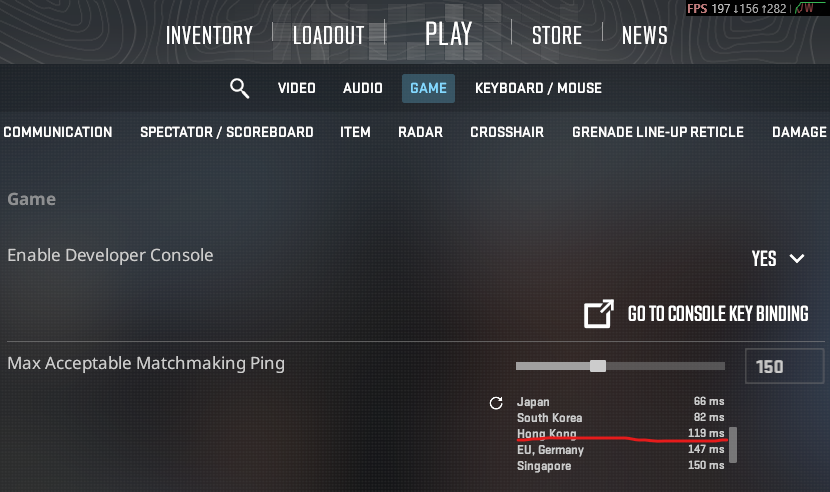

# CS2 Region Blocker

A oversimplified Powershell script of [EbadiDev/cs2-server-picker](https://github.com/EbadiDev/cs2-server-picker). It's just the original tool did not work for me, I created this script using the commands from "cs2-server-picker".

## How it works

Same as "cs2-server-picker", it adds firewall rules to your Windows system to block communication to and from relay servers to a region.

Since it's only blocking the relay servers but not the actual matchmaking server, you will still see the blocked region in the server list, but if you have a region with even lower ping, you should be fine.

This script hardcoded to block Hong Kong region by default. In my case, before blocking, I got 40+ ping on Hong Kong, which is lowest. Now it's higher than Japan so I can get match in Japan. 

PS. If you still get lowest ping in the region you blocked, I can not gurantee you that you won't get a match in that region.

 

## Usage

Open a Powershell as administrator(**‼️High Privilege, make sure you understand the script and know it's safe to run‼️**)

### Add firewall rules

```
.\cs2_region_blocker.ps1 -Action add
```

### Remove existing firewall rules

```
.\cs2_region_blocker.ps1 -Action remove
```
